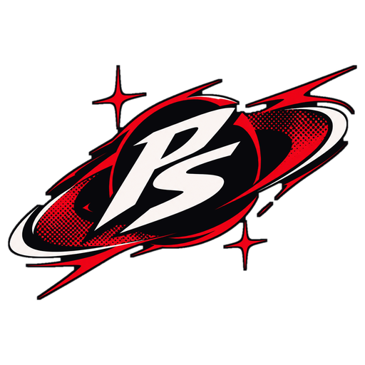
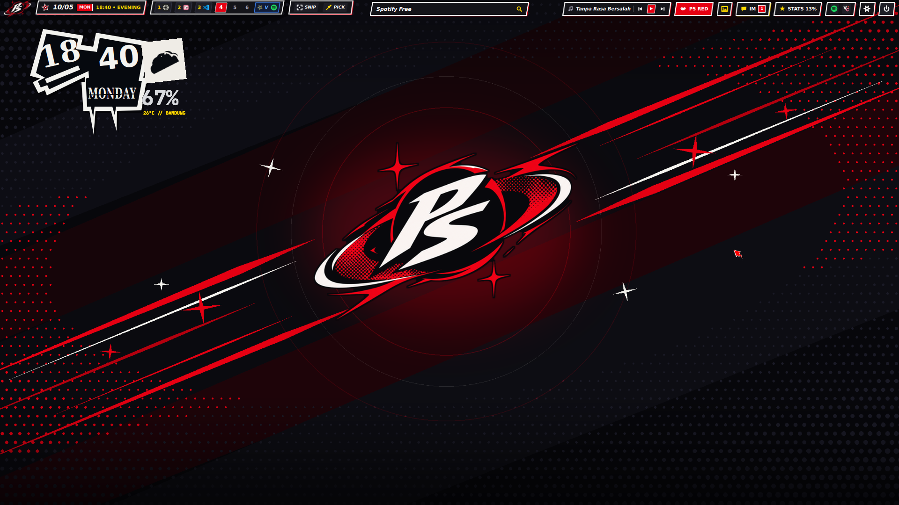

<div align="center">
  
  <h1>PhantomShell</h1>
  <p><strong>Persona 5 Royal Inspired Desktop Shell for Hyprland &amp; Quickshell on NixOS</strong></p>
</div>

---

## Overview

**PhantomShell** is a custom Wayland desktop shell built with **Quickshell (Qt6 / QML)** and **Hyprland (Hyprlang Lua)**, designed around the high-contrast comic-cutout visual language of *Persona 5 Royal*.

Every surface—from the skewed top/bottom bar, Velvet Room special workspace dimension, and tactical workspace overview to the jagged calendar/weather desktop widget, SNS notification center, and native PAM lock screen—is rendered directly in hardware-accelerated QML Canvas without heavy external widget daemons.



---

## Key Features

- **Phantom Bar (`PhantomBar.qml`)**
  - Configurable **Top** or **Bottom** placement with four layout styles (`P5 Skew`, `Float`, `Hug Bar`, `Islands`) and auto-hide support (`SUPER + J`).
  - Skewed workspace indicators supporting **Arabic (`1, 2, 3`)**, **Roman (`I, II, III`)**, or **Japanese Kanji (`一, 二, 三`)** numerals with live per-workspace app icons.
  - Dedicated **Velvet Room (`V // VELVET`)** special workspace pill with azure/gold highlights, app badges, left-click toggle, and right-click quick window transfer.
  - Integrated date/period HUD (`MORNING`, `LUNCHTIME`, `AFTER SCHOOL`, `EVENING`, `DARK HOUR`) with interactive **Phantom Calendar**, active window **Dynamic Island**, utility strip (snip, color picker, mic, dark mode), MPRIS media pill, SNS inbox trigger, system stats pill, and system tray popup.
- **Velvet Room Special Workspace (`SUPER + S` — `ScreenFrame.qml` & `PhantomState.qml`)**
  - Persistent scratchpad dimension inspired by the *Persona* Velvet Room—stays active across workspace switches and app launches/closures until explicitly exited with `SUPER + S`.
  - Full-screen diagonal azure/gold transition slash (`ENTERING THE VELVET ROOM` / `RETURNING TO REALITY`), deep-indigo atmospheric vignette, corner tactical brackets, floating gold stars, and automatic azure active window border (`#60a5fa`).
- **Tactical Overlays (`dots/quickshell/modules/overlays/`)**
  - **Workspace Overview (`PhantomOverview.qml` — `SUPER + Tab`)**: 10-workspace tactical grid with live window cards, real-time search filter, per-window mouse actions (Left-click focus, Middle-click close, Right-click send/recall Velvet Room), and an integrated **Velvet Room Scratchpad Dock**.
  - **Clipboard Compendium (`PhantomClipboard.qml` — `SUPER + V`)**: `cliphist` history manager with instant search, one-click copy, item deletion, and full wipe.
  - **Emoji Compendium (`PhantomEmoji.qml` — `SUPER + .`)**: Categorized emoji selector with search and instant clipboard copy.
  - **Tactics Keybind Cheatsheet (`PhantomCheatsheet.qml` — `SUPER + /`)**: Filterable in-shell reference of all Hyprland and PhantomShell keybindings.
- **Desktop Background, Clock, Weather, Cava & Synced Lyrics (`PhantomBackground.qml` & `PhantomWallpaperSelector.qml`)**
  - Wallpaper engine with smooth workspace parallax, zoom controls, **Metaverse Shift** diagonal transition animations (`ScreenFrame.qml`), and a visual **Wallpaper Selector (`CTRL + SUPER + T`)**.
  - Authentic *Persona 5* jagged cutout desktop clock and real-time weather stamp powered by Open-Meteo / OpenWeather (`scripts/phantom-weather.py`).
  - Bottom split **Cava** audio spectrum visualizer (`24 FPS`, automatic sleep on silence) paired with borderless multi-line synchronized lyrics (`scripts/phantom-lyrics.py`).
- **Velvet Room Settings Suite (`PhantomSettings.qml` — `SUPER + I`)**
  - **Theme & Palette:** Live wallpaper switcher, parallax controls, and 7 Persona color presets (*Phantom Crimson*, *S.E.E.S. Reload Blue*, *Midnight Channel Gold*, *Kasumi Violet*, *Futaba Cyber Matrix*, *Akechi Crow*, *Monochrome*).
  - **Bar & Desktop:** Bar position, style, workspace count, numeral style, clock style (`P5 Slant`, `Minimal`, `Cyber HUD`), Cava visualizer, and synced lyrics toggles.
  - **Network & Audio:** Built-in Wi-Fi scanner/connector (`nmcli`), Bluetooth device manager (`bluetoothctl`), PipeWire volume, and backlight controls.
  - **Displays & Hyprland:** Multi-monitor layout configurator, **InFocus / Projector Presentation Mirror** modes (`Extend`, `Mirror Auto`, `InFocus 1080p`, `InFocus 720p`), resolution/Hz selector, and live persisted Hyprland tuning (`gaps_in`, `gaps_out`, `border_size`, `rounding`, `blur`).
  - **OTA Updater & Sync (`UpdaterService.qml` & `scripts/phantom-sync`):** Built-in Git update checker, one-click pull, and automatic synchronization to `~/.config` and `/etc/nixos/dotfiles`.
- **Interactive Audio & Brightness OSD (`PhantomOsd.qml` & `AudioOsdService.qml`)**
  - Skewed Persona gauge popup with direct mouse click-and-drag slider, scroll-wheel fine adjustment, click-to-mute badge, and hover keep-alive.
- **Phantom Launcher (`PhantomLauncher.qml` — `SUPER` / `SUPER + D`)**
  - Full-color desktop application launcher with skewed selection slashes and built-in shell commands (`>lock`, `>settings`, `>stats`, `>notify`, `>theme ...`).
- **SNS Phone & Comic Bubble Notifications (`PhantomNotifications.qml` & `P5ComicBubble.qml`)**
  - Native `org.freedesktop.Notifications` server rendering incoming alerts as *Persona 5* IM comic bubbles with ransom-note sender ribbons, desktop app icon resolution, and notification SFX (`persona-5-notif-sound.wav`).
- **Thieves Den Control Center (`PhantomDashboard.qml` & `P5PentagonStats.qml` — `SUPER + N`)**
  - Interactive 5-Point Star system monitor mapping CPU (*Knowledge*), RAM (*Guts*), GPU (*Proficiency*), Disk (*Kindness*), and Temperature (*Charm*), alongside star sliders for audio/brightness and MPRIS media controls.
- **Calling Card Lock Screen & Session Menu (`PhantomLock.qml` & `PhantomSession.qml`)**
  - Native Wayland session lock (`WlSessionLock`) with Linux PAM authentication (`PamContext`), `★`-masked password field, and Calling Card power menu (`SUPER + Escape`).

---

## Project Structure

```text
phantomshell/
├── dots/
│   ├── hypr/                  # Modular Hyprland Lua configuration
│   │   ├── hyprland.lua       # Main entrypoint
│   │   └── lua/               # settings, env, general, animations, rules, binds
│   ├── quickshell/            # Quickshell Qt6/QML desktop shell
│   │   ├── shell.qml          # Root shell entrypoint & IPC handlers
│   │   ├── assets/            # Logos, wallpapers, preview, avatars, and notification SFX
│   │   ├── config/            # PhantomState.qml global state hub
│   │   ├── services/          # Modular services (AudioOsd, Display, Media, Network, Notification, System, ThemePresets, Updater)
│   │   ├── components/        # Reusable P5 UI primitives (SkewedCard, Star, ComicBubble, PentagonStats, etc.)
│   │   └── modules/           # bar, background, dashboard, frame, launcher, lock, notifications, osd, overlays, session, settings
│   ├── kitty/                 # Kitty terminal theme (Phantom Crimson)
│   ├── fastfetch/             # Fastfetch configuration
│   ├── cava/                  # Cava shaders and color themes
│   └── matugen/               # Material You / custom palette templates
├── nix/                       # NixOS and Home Manager modules
│   ├── packages.nix
│   ├── nixos-module.nix
│   └── hm-module.nix
├── scripts/
│   ├── phantomshell           # CLI controller for IPC toggles, themes, screenshots, OCR, recording, & app launch
│   ├── phantom-sync           # Dotfiles synchronizer & Git OTA updater helper
│   ├── phantom-weather.py     # Lightweight weather fetcher (Open-Meteo / OpenWeather)
│   ├── phantom-lyrics.py      # Real-time LRCLIB synced lyrics daemon
│   ├── build-p5-cursors.py    # Persona 5 animated cursor theme generator
│   └── build-theme-wallpapers.py
├── dev.sh                     # Live development & symlink helper script
└── flake.nix                  # Nix Flake definition
```

---

## Default Keybindings

Configured in [`dots/hypr/lua/binds.lua`](dots/hypr/lua/binds.lua) (`SUPER` as main modifier):

| Shortcut | Action |
| :--- | :--- |
| `SUPER` (Tap) / `SUPER + D` | Toggle **Phantom App Launcher** |
| `SUPER + Tab` | Toggle **Workspace Overview & Velvet Room Dock** |
| `SUPER + S` | Toggle **Velvet Room** (Persistent Special Workspace) |
| `SUPER + ALT + S` | Send active window to **Velvet Room** |
| `SUPER + I` | Toggle **Velvet Room Settings GUI** |
| `SUPER + N` / `SUPER + G` | Toggle **Thieves Den Control Center & Pentagon Stats** |
| `SUPER + A` / `SUPER + B` / `SUPER + O` | Toggle **SNS Notification Center** |
| `SUPER + M` | Toggle **MPRIS Media Player Popup** |
| `SUPER + V` | Toggle **Clipboard Compendium** |
| `SUPER + .` | Toggle **Emoji Compendium** |
| `SUPER + /` | Toggle **Tactics Keybind Cheatsheet** |
| `SUPER + J` | Toggle **Phantom Bar** Auto-Hide |
| `CTRL + SUPER + T` | Toggle **Wallpaper Selector** |
| `CTRL + SUPER + P` | Cycle **Persona Theme Presets** |
| `SUPER + L` | Lock screen (**Persona 5 Calling Card Lock**) |
| `SUPER + Escape` | Toggle **Calling Card Power / Session Menu** |
| `SUPER + Return` / `SUPER + T` | Launch terminal (`kitty`) |
| `SUPER + W` | Launch web browser |
| `SUPER + E` | Launch file manager |
| `SUPER + C` | Launch code editor |
| `SUPER + Q` | Close active window |
| `SUPER + F` / `SUPER + SHIFT + F` | Toggle maximize / fullscreen |
| `SUPER + Space` | Toggle floating window |
| `SUPER + SHIFT + S` | Region screenshot to clipboard & file |
| `SUPER + SHIFT + X` | Region OCR text recognition to clipboard |
| `SUPER + SHIFT + C` | Pick screen color (`#RRGGBB`) to clipboard |
| `SUPER + SHIFT + R` | Toggle region screen recording |

---

## CLI & Synchronization

The `phantomshell` CLI (`scripts/phantomshell`) controls the running shell over Quickshell IPC:

```bash
# Toggle UI panels & overlays
phantomshell toggle launcher
phantomshell toggle overview
phantomshell toggle settings
phantomshell toggle dashboard
phantomshell toggle notifications
phantomshell toggle clipboard
phantomshell toggle emoji
phantomshell toggle cheatsheet
phantomshell toggle session
phantomshell lock

# Switch theme presets
phantomshell preset p5-crimson
phantomshell preset p3-reload
phantomshell preset p4-golden
phantomshell cycle-theme

# Set wallpaper & trigger Metaverse Shift
phantomshell wallpaper /path/to/wallpaper.png

# Send a test Persona 5 IM notification
phantomshell notify-test "Futaba" "All systems operational!"
```

To sync changes from the repository to `~/.config` and `/etc/nixos/dotfiles`:

```bash
./scripts/phantom-sync sync
```

---

## Running & Installation

### Live Development Mode

Run `dev.sh` from the repository root to link configurations and launch the Quickshell instance:

```bash
./dev.sh
```

Or launch Quickshell directly pointing to `dots/quickshell`:

```bash
qs -p ./dots/quickshell
```

### NixOS / Home Manager Flake

Add `phantomshell` to your `flake.nix` inputs and import either `nixosModules.default` or `homeManagerModules.default`:

```nix
{
  inputs.phantomshell.url = "github:ryhndastra/phantomshell";
}
```

---

## Credits

- **Creator & Lead Designer:** Sho (`ryhndastra`)
- **Inspiration:** *Persona 5 Royal* by Atlus / P-Studio
- **Built With:** [Hyprland](https://hyprland.org/), [Quickshell](https://quickshell.outfoxxed.me/), and [NixOS](https://nixos.org/)
