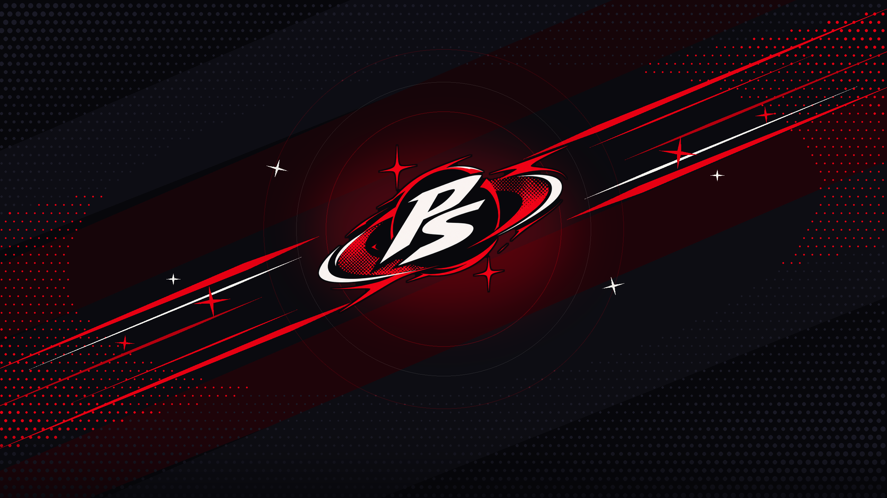

<div align="center">
  
  <h1>PhantomShell</h1>
  <p><strong>Persona 5 Royal Inspired Desktop Shell for Hyprland &amp; Quickshell on NixOS</strong></p>
</div>

---

## Overview

**PhantomShell** is a custom Wayland desktop shell built with **Quickshell (Qt6 / QML)** and **Hyprland (Hyprlang Lua)**, designed around the high-contrast comic-cutout visual language of *Persona 5 Royal*.

Every surface—from the skewed top/bottom bar and jagged calendar/weather desktop widget to the Velvet Room configuration suite, SNS notification center, and native PAM lock screen—is rendered directly in hardware-accelerated QML Canvas without heavy external widget daemons.



---

## Key Features

- **Phantom Bar (`PhantomBar.qml`)**
  - Configurable **Top** or **Bottom** placement with four layout styles (`P5 Skew`, `Float`, `Hug Bar`, `Islands`).
  - Skewed workspace indicators supporting **Arabic (`1, 2, 3`)**, **Roman (`I, II, III`)**, or **Japanese Kanji (`一, 二, 三`)** numerals.
  - Integrated date/period HUD (`MORNING`, `AFTER SCHOOL`, `EVENING`, `DARK HOUR`), active window Dynamic Island, quick snipping/color-picker strip, SNS inbox trigger, and system tray pills.
- **Desktop Background, Clock, Weather, Cava & Synced Lyrics (`PhantomBackground.qml`)**
  - Wallpaper engine with smooth workspace parallax and zoom controls.
  - Authentic *Persona 5* jagged cutout desktop clock and real-time weather stamp powered by Open-Meteo / OpenWeather (`scripts/phantom-weather.py`), polling once every 15 minutes for zero idle CPU/GPU overhead.
  - Bottom split **Cava** audio spectrum visualizer (`24 FPS`, automatic sleep on silence) paired with borderless multi-line synchronized lyrics (`past2`, `past1`, highlighted `now`, `next1`, `next2`) strictly sourced from active **Spotify** or **Apple Music** playback (`scripts/phantom-lyrics.py`).
- **Velvet Room Settings Suite (`PhantomSettings.qml`)**
  - **1. Theme:** Live wallpaper switcher, parallax controls, and 9 instant color presets (*Phantom Crimson*, *S.E.E.S. Reload Blue*, *Midnight Channel Gold*, *Metaverse Violet*, *Mementos Acid*, *Leblanc Roast*, *Shujin Uniform*, *Futaba Cyber Oracle*, *Akechi Crow*).
  - **2. Bar:** Edge position, visual style, workspace count, numeral style, and utility toggles.
  - **3. Desktop:** Clock style (`P5 Slant`, `Minimal`, `Cyber HUD`), placement, scale, Cava height, and synced lyrics toggles.
  - **4. UI & IM:** 5-Point Star Radar vs. horizontal gauge bars, perimeter frame, and Do Not Disturb.
  - **5. Hypr & Displays:** Visual multi-monitor selector, **InFocus / Projector Presentation Mirror** modes (`Extend`, `Mirror Auto`, `InFocus 1080p`, `InFocus 720p`), per-monitor resolution & refresh rate dropdown (automatically defaults to highest supported Hz), orientation, scale, PipeWire volume, backlight brightness, and live Hyprland IPC tuning (`gaps_in`, `gaps_out`, `border_size`, `rounding`, `blur`).
  - **6. About:** Project overview, creator profile, and live hardware/OS specifications.
- **Phantom Launcher (`PhantomLauncher.qml`)**
  - Full-color desktop application launcher with skewed selection slashes and built-in shell commands (`>lock`, `>settings`, `>stats`, `>notify`, `>theme ...`).
- **SNS Phone & Comic Bubble Notifications (`PhantomNotifications.qml` & `P5ComicBubble.qml`)**
  - Native `org.freedesktop.Notifications` server rendering incoming alerts as *Persona 5* IM comic bubbles with ransom-note sender ribbons, app icons (or `ren.png` fallback), and custom notification audio (`persona-5-notif-sound.wav`).
- **Thieves Den Control Center (`PhantomDashboard.qml` & `P5PentagonStats.qml`)**
  - Interactive 5-Point Star system monitor mapping CPU (*Knowledge*), RAM (*Guts*), GPU (*Proficiency*), Disk (*Kindness*), and Temperature (*Charm*), alongside star sliders for audio/brightness and MPRIS media controls.
- **Calling Card Lock Screen (`PhantomLock.qml`)**
  - Native Wayland session lock (`WlSessionLock`) with real Linux PAM authentication (`PamContext`), `★`-masked password field, shake feedback on invalid credentials, clock HUD, and suspend button.

---

## Project Structure

```text
phantomshell/
├── dots/
│   ├── hypr/                  # Modular Hyprland Lua configuration
│   │   ├── hyprland.lua       # Main entrypoint
│   │   └── lua/               # settings, env, general, animations, rules, binds
│   ├── quickshell/            # Quickshell Qt6/QML desktop shell
│   │   ├── shell.qml          # Root shell entrypoint & IPC handlers
│   │   ├── assets/            # Logos, wallpapers, avatars, and notification SFX
│   │   ├── config/            # PhantomState.qml global state, themes, & IPC
│   │   ├── components/        # Reusable P5 UI primitives (SkewedCard, Star, ComicBubble, etc.)
│   │   └── modules/           # bar, background, launcher, settings, dashboard, notifications, lock, osd, session
│   ├── kitty/                 # Kitty terminal theme (Phantom Crimson)
│   ├── fastfetch/             # Fastfetch configuration
│   ├── cava/                  # Cava shaders and color themes
│   └── matugen/               # Material You / custom palette templates
├── nix/                       # NixOS and Home Manager modules
│   ├── packages.nix
│   ├── nixos-module.nix
│   └── hm-module.nix
├── scripts/
│   ├── phantomshell           # CLI controller for IPC toggles, themes, and presets
│   ├── phantom-weather.py     # Lightweight weather fetcher (Open-Meteo / OpenWeather)
│   └── phantom-lyrics.py      # Real-time LRCLIB synced lyrics daemon for Spotify
├── dev.sh                     # Live development & symlink helper script
└── flake.nix                  # Nix Flake definition
```

---

## Default Keybindings

Configured in [`dots/hypr/lua/binds.lua`](dots/hypr/lua/binds.lua) (`SUPER` as main modifier):

| Shortcut | Action |
| :--- | :--- |
| `SUPER` (Tap) / `SUPER + D` | Toggle **Phantom App Launcher** |
| `SUPER + I` / `SUPER + ,` | Toggle **Velvet Room Settings GUI** |
| `SUPER + S` | Toggle **Thieves Den System Stats & Control Center** |
| `SUPER + N` | Toggle **SNS Notification Inbox** |
| `SUPER + P` / `SUPER + SHIFT + L` | Lock screen (**Persona 5 Calling Card Lock**) |
| `SUPER + X` | Toggle **Session Power Menu** |
| `SUPER + T` | Cycle color theme presets (`P5 Crimson` / `P3 Reload` / `P4 Golden` / ...) |
| `SUPER + B` | Toggle **Phantom Bar** position (`Top` / `Bottom`) |
| `SUPER + RETURN` | Launch terminal (`ghostty` / `kitty`) |
| `SUPER + E` | Launch file manager (`nautilus`) |
| `SUPER + Q` | Close active window |
| `SUPER + F` | Toggle fullscreen |
| `SUPER + V` | Toggle floating window |
| `SUPER + SHIFT + S` | Region screenshot to clipboard (`grim` + `slurp` + `wl-copy`) |

---

## CLI Usage

The `phantomshell` script in `scripts/phantomshell` controls the running shell over Quickshell IPC:

```bash
# Toggle UI panels
phantomshell toggle launcher
phantomshell toggle settings
phantomshell toggle dashboard
phantomshell toggle notifications
phantomshell toggle session
phantomshell lock

# Switch theme presets
phantomshell preset p5-crimson
phantomshell preset p3-reload
phantomshell preset p4-golden
phantomshell cycle-theme

# Set wallpaper & regenerate palette
phantomshell wallpaper /path/to/wallpaper.png

# Send a test Persona 5 IM notification
phantomshell notify-test
```

---

## Running & Installation

### Live Development Mode

Run `dev.sh` from the repository root to link configurations and launch the Quickshell instance:

```bash
./dev.sh
```

Or launch Quickshell directly pointing to `dots/quickshell`:

```bash
qs -p ./dots/quickshell
```

### NixOS / Home Manager Flake

Add `phantomshell` to your `flake.nix` inputs and import either `nixosModules.default` or `homeManagerModules.default`:

```nix
{
  inputs.phantomshell.url = "github:ryhndastra/phantomshell";
}
```

---

## Credits

- **Creator & Lead Designer:** Sho (`ryhndastra`)
- **Inspiration:** *Persona 5 Royal* by Atlus / P-Studio
- **Built With:** [Hyprland](https://hyprland.org/), [Quickshell](https://quickshell.outfoxxed.me/), and [NixOS](https://nixos.org/)
